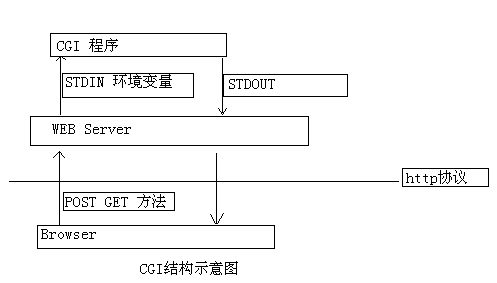

# CGI

> CGI(common Gateway interface)是http服务器与应用程序交互数据的一种工具。CGI程序必须运行在网络服务器上。NOTE，cgi只是接口协议，根本不是什么语言。 
>
> [CGI协议——rfc3875](https://www.ietf.org/rfc/rfc3875)

### CGI种类

1. CGI
2. FastCGI
3. WSGI

---------

**下面介绍一般CGI相关**

### 环境变量

环境变量是文本串(名字/值对),可以被OSShell或其他程序设置 ,也可以被其他程序访问。它们是Web服务器传递数据给CGI程序的简单手段,之所以称为环境变量是因为它们是全局变量,任何程序都可以存取它们。 

环境变量                    |    意义
---------------------------  |:-------------:|
SERVER_NAME CGI  |  脚本运行时的主机名和IP地址.
SERVER_SOFTWARE |  你的服务器的类型如： CERN/3.0 或 NCSA/1.3.
GATEWAY_INTERFACE | 运行的CGI版本. 对于UNIX服务器, 这是CGI/1.1.
SERVER_PROTOCOL | 服务器运行的HTTP协议. 这里当是HTTP/1.0.
SERVER_PORT |服务器运行的TCP口，通常Web服务器是80.
REQUEST_METHOD | POST 或 GET, 取决于你的表单是怎样递交的.
HTTP_ACCEPT | 浏览器能直接接收的Content-types, 可以有HTTP Accept header定义.
HTTP_USER_AGENT | 递交表单的浏览器的名称、版本 和其他平台性的附加信息。
HTTP_REFERER | 递交表单的文本的 URL，不是所有的浏览器都发出这个信息，不要依赖它
PATH_INFO | 附加的路径信息, 由浏览器通过GET方法发出.
PATH_TRANSLATED |在PATH_INFO中系统规定的路径信息.
SCRIPT_NAME | 指向这个CGI脚本的路径, 是在URL中显示的(如, /cgi-bin/thescript).
QUERY_STRING | 本参数或者表单输入项(如果是用GET递交). QUERY_STRING包含URL中问号后面的参数.
REMOTE_HOST | 递交脚本的主机名，这个值不能被设置.
REMOTE_ADDR | 递交脚本的主机IP地址.
REMOTE_USER | 递交脚本的用户名. 如果服务器的authentication被激活，这个值可以设置。
REMOTE_IDENT | 如果Web服务器是在ident (一种确认用户连接你的协议)运行, 递交表单的系统也在运行ident, 这个变量就含有ident返回值.
CONTENT_TYPE | 如果表单是用POST递交, 这个值将是 application/x-www-form-urlencoded. 在上载文件的表单中, content-type 是个 multipart/form-data.
CONTENT_LENGTH |对于用POST递交的表单,标准输入口的字节数.

### 工作流程

> **Apache Tutorial: Dynamic Content with CGI**
>      **STDIN and STDOUT**
> Other communication between the server and the client happens over standard input (STDIN) and standard output (STDOUT). In normal everyday context, STDIN means the keyboard, or a file that a program is given to act on, and STDOUT usually means the console or screen.
>
> When you POST a web form to a CGI program, the data in that form is bundled up into a special format and gets delivered to your CGI program over STDIN. The program then can process that data as though it was coming in from the keyboard, or from a file
>
> The "special format" is very simple. A field name and its value are joined together with an equals (=) sign, and pairs of values are joined together with an ampersand (&). Inconvenient characters like spaces, ampersands, and equals signs, are converted into their hex equivalent so that they don't gum up the works. The whole data string might look something like:
>
>  `name=Rich%20Bowen&city=Lexington&state=KY&sidekick=Squirrel%20Monkey`
>
> You'll sometimes also see this type of string appended to a URL. When that is done, the server puts that string into the environment variable called QUERY_STRING. That's called a GET request. Your HTML form specifies whether a GET or a POST is used to deliver the data, by setting the METHOD attribute in the FORM tag.
>
> Your program is then responsible for splitting that string up into useful information. Fortunately, there are libraries and modules available to help you process this data, as well as handle other of the aspects of your CGI program.

其中下面内容中有句话感觉特别的有道理

> When you write CGI programs, you should consider using a code library, or module, to do most of the grunt work for you. This leads to fewer errors, and faster development. 

### CCGI

> cgic是用c写cgi程序的一个很小的库 

[ccgi英文文档](https://boutell.com/cgic/ )

[ccgi中文文档-那人好像一条狗](https://www.cnblogs.com/programmer-wfq/p/5582114.html )

### HTML --->POST & GET

> 拓展阅读：
>
> [get & post的区别 ](https://baijiahao.baidu.com/s?id=1620934682611653374&wfr=spider&for=pc ) 
>
> [区别2](https://www.cnblogs.com/logsharing/p/8448446.html)

#### from表单元素

- action元素，当表单内的submi按钮被点击后，该属性被指定将表单内容提交到那个地址。
- method元素，指定该表单发送何种请求。该值可为get或post。

#### input 

- 提交、重设、无动作按钮。type值分别为submi、reset、button

### 轻量级http服务器

- Tinyhttp	 [超详细分析](https://www.cnblogs.com/qiyeboy/p/6296387.html )

- http-server

- Lighttpd         <-------**下面用的就是这个**

   [官方网站](http://www.lighttpd.net/)

  [官方配置文档](http://redmine.lighttpd.net/projects/lighttpd/wiki/InstallFromSource )

  [比较详细的安装中文文档](http://www.mamicode.com/info-detail-1489392.html )

  [配合看的官方文档](http://redmine.lighttpd.net/projects/lighttpd/wiki/Docs )

- Thttpd  [官方文档](http://www.acme.com/software/thttpd/thttpd_man.html )

- NginxNginx

- TUX

### Lighttpd 配置与安装

[详细安装参考](https://blog.csdn.net/aifeming/article/details/52947592 )

[简易使用配置参考](https://redmine.lighttpd.net/projects/lighttpd/wiki/TutorialConfiguration )

1. 下载lighttpss

   wget -c https://download.lighttpd.net/lighttpd/releases-1.4.x/lighttpd-1.4.54.tar.gz

2. 解压并进入目录

   tar -zxvf [filename]

3.  *进入lighttp中make的时候总是会报一个错误类似于*

   `XXXXXXXXXXXXXXXXXXXXXX recompile with -fPIC ` 的错误，这个时候需要在bzip2 的Makefile中，在其CFLAGS编译选项上加入 -fPIC ，重新make &&  make install 之后就可以正常编译Lighttp了。

**特别注意**

​	`make -f Makefile-libbz2_so `

> -f 标志是使bzip2 根据另一个Makefile来编译，就是Makefile-libbz2_so文件，创建一个动态的libbz.so库文		件，然后把bzip2工具连接到这个库上 

4. ` alias.url += ( "/cgi-bin" => server_root + "/cgi-bin" ) ` 由于之前在cgi.conf中的配置，所以目录名应该为cgi-bin 而不是 cgibin。要么改配置文件，要么改目录名。

5. 到此为止，可将编译好的cgi文件放在cgi-bin目录下。如有一个文件叫hello.cgi，那么在浏览器中使用

   <u>[ip] + /cgi-bin/hello.cgi</u>  就可以访问lighttpd下的cgi文件。

​	

## 参考文献：

[资料来源01](https://blog.csdn.net/sinat_32266863/article/details/61616319 )

[资料来源02](https://blog.csdn.net/qq_28081081/article/details/80631812 )

[W3 CGI：通用网关接口](https://www.w3.org/CGI/)

《疯狂HTML+CSS+Javascript讲义（第二版）》